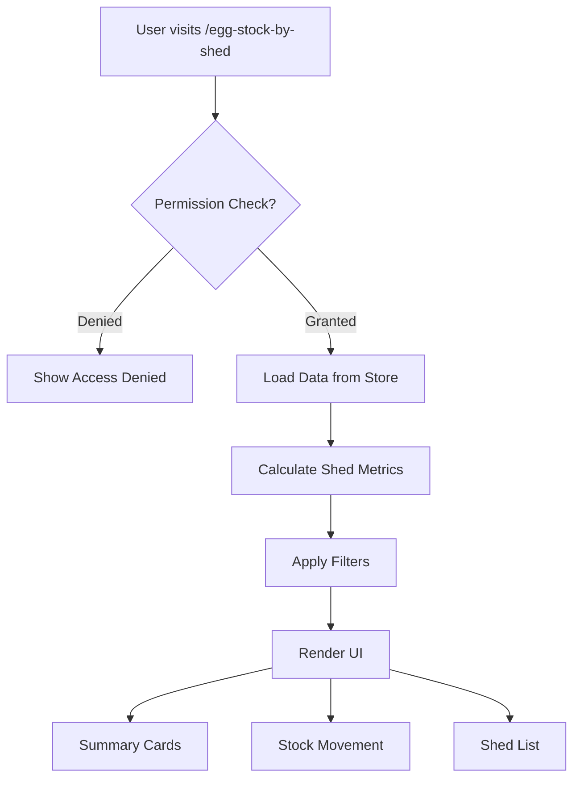
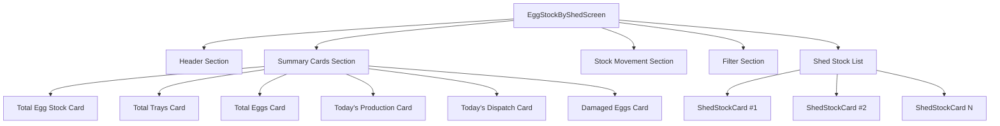
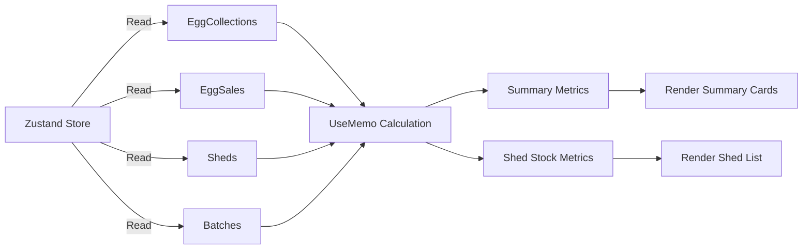

# Design Document: Egg Stock by Shed Page

## Overview

This document outlines the technical design for the "Egg Stock by Shed" page, a new Owner-facing operational screen that provides comprehensive visibility into egg inventory across all poultry farm sheds. The page aggregates egg collection data, sales data, and calculates real-time stock levels at the shed level to help owners make informed operational decisions.

### Key Features

- **Summary Metrics**: Total stock, trays, eggs, today's production, dispatch, and damage across all sheds
- **Shed-Wise Breakdown**: Per-shed stock details including current stock, trays, loose eggs, production, dispatch, damage, closing stock, and status indicators
- **Stock Movement Analysis**: Opening stock, production, sales, damage, adjustments, and closing stock
- **Filtering Capabilities**: Filter by shed, date, and egg type/grade
- **Permission Control**: Owner-only access with existing permission system
- **Responsive Design**: Mobile-first layout optimized for touch devices

### Non-Goals

- Export functionality (future-proofed for implementation)
- Historical trend charts (future-proofed for implementation)
- Audit log display
- Real-time data synchronization (uses existing offline-capable data store)

## Architecture

### Component Hierarchy

```
EggStockByShedScreen (Page)
├── Header Section
│   ├── Title: "Egg Stock by Shed"
│   ├── Date Selector (date input)
│   └── Back Button
├── Summary Cards Section
│   ├── Total Egg Stock Card
│   ├── Total Trays Card
│   ├── Total Eggs Card
│   ├── Today's Production Card
│   ├── Today's Dispatch Card
│   └── Damaged Eggs Card
├── Stock Movement Section
│   ├── Opening Stock Row
│   ├── Production Row
│   ├── Sales/Dispatch Row
│   ├── Damage Row
│   ├── Adjustments Row (conditional)
│   └── Closing Stock Row
├── Filter Section
│   ├── Shed Filter (All/Shed dropdown)
│   ├── Date Filter (date picker)
│   ├── Egg Type Filter (Good/Damaged/All)
│   └── Apply/Reset Buttons
├── Shed Stock List
│   └── ShedStockCard (repeated for each shed)
│       ├── Shed Header (name, status badge)
│       ├── Stock Metrics (current stock, trays, loose eggs)
│       ├── Daily Activity (production, dispatch, damage)
│       └── Closing Stock & Status
└── Empty State (when no sheds exist)
```

### Data Flow

```
User visits /egg-stock-by-shed
    ↓
Permission Check: useCan('exportReports') for OWNER role
    ↓
If unauthorized → Redirect to home or show "Access Denied"
    ↓
Load data from Zustand store:
    - sheds: all active sheds
    - batches: all batches (to map sheds to batches)
    - eggCollections: all collections (with date filter)
    - eggSales: all sales (with date filter)
    ↓
Calculate per-shed metrics using aggregated data
    ↓
Apply user filters (shed, date, egg type)
    ↓
Render summary cards with calculated totals
    ↓
Render shed-wise breakdown with filtered data
```

## Components and Interfaces

### Main Screen Component

**File**: `src/screens/EggStockByShedScreen.tsx`

```typescript
export function EggStockByShedScreen() {
  // Permission check
  const user = useCurrentUser();
  const canView = useCan('exportReports');
  
  // Data from store
  const sheds = useApp(s => s.sheds);
  const batches = useApp(s => s.batches);
  const eggCollections = useApp(s => s.eggCollections);
  const eggSales = useApp(s => s.eggSales);
  
  // State
  const [selectedDate, setSelectedDate] = useState(todayISO());
  const [selectedShedId, setSelectedShedId] = useState<string | 'ALL'>('ALL');
  const [eggTypeFilter, setEggTypeFilter] = useState<'ALL' | 'GOOD' | 'DAMAGED'>('ALL');
  
  // Calculated data
  const summary = useMemo(() => calculateSummary(...), [data, selectedDate]);
  const shedStock = useMemo(() => calculateShedStock(...), [data, selectedDate, selectedShedId]);
  
  // Render
  return <Page><Header /><SummaryCards /><StockMovement /><Filters /><ShedList /></Page>;
}
```

### Supporting Components (Reuse Existing)

- **Header**: Use existing `Header` component from `@/components/ui/Header`
- **Card**: Use existing `Card` component from `@/components/ui/Card`
- **StatusBadge**: Use existing `StatusBadge` for HEALTHY/LOW_STOCK/CRITICAL
- **Button**: Use existing `Button` component
- **EmptyState**: Use existing `EmptyState` for empty states
- **SectionTitle**: Use existing `SectionTitle` for section headers

### New Component: SummaryCard

**Location**: Create in `src/components/ui/` as `SummaryCard.tsx`

```typescript
export function SummaryCard({ label, value, subValue, trend, tone = 'brand' }: {
  label: string;
  value: string;
  subValue?: string;
  trend?: 'up' | 'down' | 'neutral';
  tone?: 'brand' | 'accent' | 'success' | 'warn' | 'danger';
}) {
  // Reuse Card component, apply tone-based styling
}
```

### New Component: ShedStockCard

**Location**: Create in `src/components/ui/` as `ShedStockCard.tsx`

```typescript
export function ShedStockCard({ shed, stock, status }: {
  shed: Shed;
  stock: ShedStockMetrics;
  status: 'HEALTHY' | 'LOW_STOCK' | 'CRITICAL';
}) {
  // Display shed name, stock metrics, daily activity, status
}
```

## Data Models and Calculations

### Reuse Existing Types

```typescript
import type { Shed, Batch, EggCollection, EggSale } from '@/types';
```

### New Type: ShedStockMetrics

```typescript
export interface ShedStockMetrics {
  shedId: string;
  currentStock: number;       // Total available eggs
  trays: number;              // Complete trays (floor(currentStock / 30))
  looseEggs: number;          // Remaining eggs (currentStock mod 30)
  todayProduction: number;    // Today's good + damaged + cracked
  todayDispatch: number;      // Today's eggs sold (trays × 30)
  todayDamage: number;        // Today's damaged + cracked
  closingStock: number;       // Opening + Production - Dispatch - Damage
  status: 'HEALTHY' | 'LOW_STOCK' | 'CRITICAL';
}
```

### Reuse Existing Calculation Functions

From `@/lib/calc.ts`:

```typescript
import { eggSummary, eggTotalsRange, saleTotals } from '@/lib/calc';

// Reuse patterns:
// - eggSummary(batchId, eggs, onDate) → Today's collection per batch
// - eggTotalsRange(batchId, eggs, from, to) → Range-based collection
// - saleTotals(sales) → Sales aggregation
```

### New Calculation Functions

**Location**: Extend `src/lib/calc.ts` or create `src/lib/eggStockCalc.ts`

```typescript
import type { EggCollection, EggSale, Shed, Batch } from '@/types';

// Calculate stock for a specific shed as of a given date
export function shedStockMetrics(
  shed: Shed,
  batches: Batch[],
  eggCollections: EggCollection[],
  eggSales: EggSale[],
  onDate: string
): ShedStockMetrics {
  const shedBatches = batches.filter(b => b.shedId === shed.id);
  const collectionsToday = eggCollections.filter(c => 
    shedBatches.some(b => b.id === c.batchId) && c.date === onDate
  );
  const salesToday = eggSales.filter(s => 
    shedBatches.some(b => b.id === s.batchId) && s.date === onDate
  );
  
  // Calculate totals
  const totalCollected = collectionsToday.reduce((s, c) => s + c.good + c.damaged + c.cracked, 0);
  const totalSold = salesToday.reduce((s, sale) => s + sale.trays * sale.eggsPerTray, 0);
  const totalDamaged = collectionsToday.reduce((s, c) => s + c.damaged + c.cracked, 0);
  
  // Current stock (inventory formula)
  // Note: This is a simplified calculation. In production, you'd want to track opening stock.
  const currentStock = totalCollected - totalSold - totalDamaged;
  
  const trays = Math.floor(currentStock / 30);
  const looseEggs = currentStock % 30;
  
  // Determine status
  let status: 'HEALTHY' | 'LOW_STOCK' | 'CRITICAL' = 'HEALTHY';
  if (currentStock < 5000) status = 'CRITICAL';
  else if (currentStock < 10000) status = 'LOW_STOCK';
  
  return {
    shedId: shed.id,
    currentStock,
    trays,
    looseEggs,
    todayProduction: totalCollected,
    todayDispatch: totalSold,
    todayDamage: totalDamaged,
    closingStock: currentStock, // Simplified; real implementation needs opening stock
    status,
  };
}

// Calculate summary metrics across all sheds
export function calculateSummary(
  sheds: Shed[],
  batches: Batch[],
  eggCollections: EggCollection[],
  eggSales: EggSale[],
  onDate: string
): SummaryMetrics {
  const allStock = sheds.map(shed => 
    shedStockMetrics(shed, batches, eggCollections, eggSales, onDate)
  );
  
  const totalStock = allStock.reduce((s, x) => s + x.currentStock, 0);
  const totalTrays = allStock.reduce((s, x) => s + x.trays, 0);
  const totalEggs = allStock.reduce((s, x) => s + x.trays * 30 + x.looseEggs, 0);
  const totalProduction = allStock.reduce((s, x) => s + x.todayProduction, 0);
  const totalDispatch = allStock.reduce((s, x) => s + x.todayDispatch, 0);
  const totalDamage = allStock.reduce((s, x) => s + x.todayDamage, 0);
  
  return {
    totalStock,
    totalTrays,
    totalEggs,
    todayProduction: totalProduction,
    todayDispatch: totalDispatch,
    damagedEggs: totalDamage,
  };
}
```

### Stock Movement Calculation

```typescript
export interface StockMovement {
  openingStock: number;
  production: number;
  sales: number;
  damage: number;
  adjustments: number;
  closingStock: number;
}

export function calculateStockMovement(
  sheds: Shed[],
  batches: Batch[],
  eggCollections: EggCollection[],
  eggSales: EggSale[],
  onDate: string
): StockMovement {
  const summary = calculateSummary(sheds, batches, eggCollections, eggSales, onDate);
  
  // Simplified: In production, opening stock should be retrieved from previous day's closing stock
  const openingStock = 0; // Would need historical data or previous day's closing
  
  return {
    openingStock,
    production: summary.todayProduction,
    sales: summary.todayDispatch,
    damage: summary.damagedEggs,
    adjustments: 0, // Future enhancement
    closingStock: openingStock + summary.todayProduction - summary.todayDispatch - summary.damagedEggs,
  };
}
```

## Screen Layout

### Desktop Layout (Multi-Column Grid)

```
┌─────────────────────────────────────────────────────────────────────┐
│ Header: [←] Egg Stock by Shed          [Date Selector]              │
├─────────────────────────────────────────────────────────────────────┤
│                                                                     │
│ ┌──────────┐ ┌──────────┐ ┌──────────┐ ┌──────────┐ ┌──────────┐   │
│ │  Stock   │ │  Trays   │ │   Eggs   │ │  Prod    │ │ Dispatch │   │
│ │  125,450   │ │  4,181   │ │ 125,430  │ │  5,230   │ │  2,150   │   │
│ └──────────┘ └──────────┘ └──────────┘ └──────────┘ └──────────┘   │
│ ┌─────────────────────────────────────────────────────────────────┐ │
│ │ Damaged Eggs: 890                                                │ │
│ └─────────────────────────────────────────────────────────────────┘ │
├─────────────────────────────────────────────────────────────────────┤
│ Stock Movement                                                      │
│ ┌─────────────────────────────────────────────────────────────────┐ │
│ │ Opening: 120,000 | Production: 5,230 | Sales: 2,150            │ │
│ │ Damage: 890 | Adjustments: 0 | Closing: 125,430                │ │
│ └─────────────────────────────────────────────────────────────────┘ │
├─────────────────────────────────────────────────────────────────────┤
│ Filters: [Shed ▼] [Date ▼] [Type ▼] [Apply]                        │
├─────────────────────────────────────────────────────────────────────┤
│ Shed Stock List (2-column grid)                                     │
│ ┌─────────────────────┐ ┌─────────────────────┐                    │
│ │  [Gld-1]  [HEALTHY] │ │  [Br-2]  [LOW_STOCK]│                    │
│ │ Stock: 52,300       │ │ Stock: 48,100       │                    │
│ │ Trays: 1,743 Loose: │ │ Trays: 1,603 Loose: │                    │
│ │ 10                  │ │  10                  │                    │
│ │ Today: Prod 2,150   │ │ Today: Prod 2,080   │                    │
│ │ Disp: 890 Dam: 320  │ │ Disp: 920 Dam: 280  │                    │
│ │ Closing: 51,040     │ │ Closing: 47,160     │                    │
│ └─────────────────────┘ └─────────────────────┘                    │
└─────────────────────────────────────────────────────────────────────┘
```

### Mobile Layout (Single Column)

```
┌────────────────────────────────────────┐
│ [←] Egg Stock by Shed   [Date ▼]      │
├────────────────────────────────────────┤
│ ┌────────────────────────────────────┐ │
│ │  Total Stock: 125,450              │ │
│ │  Total Trays: 4,181                │ │
│ │  Total Eggs: 125,430               │ │
│ └────────────────────────────────────┘ │
│ ┌────────────────────────────────────┐ │
│ │  Today's Production: 5,230         │ │
│ │  Today's Dispatch: 2,150           │ │
│ │  Damaged Eggs: 890                 │ │
│ └────────────────────────────────────┘ │
├────────────────────────────────────────┤
│ Stock Movement                         │
│ Opening: 120,000 | Prod: 5,230        │
│ Sales: 2,150 | Damage: 890            │
│ Closing: 125,430                       │
├────────────────────────────────────────┤
│ [Shed: All ▼] [Date: Today ▼]        │
│ [Type: All ▼] [Apply]                 │
├────────────────────────────────────────┤
│ ┌────────────────────────────────────┐ │
│ │ Gld-1        [HEALTHY]             │ │
│ │ ────────────────────────────────── │ │
│ │ Stock: 52,300   Trays: 1,743       │ │
│ │ Today: Prod 2,150 Disp: 890        │ │
│ │ Dam: 320 | Closing: 51,040         │ │
│ └────────────────────────────────────┘ │
│ ┌────────────────────────────────────┐ │
│ │ Br-2         [LOW_STOCK]           │ │
│ │ ────────────────────────────────── │ │
│ │ Stock: 48,100   Trays: 1,603       │ │
│ │ Today: Prod 2,080 Disp: 920        │ │
│ │ Dam: 280 | Closing: 47,160         │ │
│ └────────────────────────────────────┘ │
└────────────────────────────────────────┘
```

## Navigation Integration

### Add to AppShell Navigation

**File**: `src/components/layout/AppShell.tsx`

Add "Egg Stock" to the Operations group:

```typescript
const GROUPS: NavGroup[] = [
  {
    title: 'Operations',
    items: [
      // ... existing items
      { to: '/feed/formulas', label: 'Formulas', icon: <FlaskConical size={17} /> },
      { to: '/egg-stock-by-shed', label: 'Egg Stock', icon: <Egg size={17} /> }, // NEW
    ],
  },
  // ... rest of groups
];
```

### Add Route

**File**: `src/App.tsx`

```typescript
import { EggStockByShedScreen } from '@/screens/EggStockByShedScreen';

<Routes>
  {/* ... existing routes */}
  <Route path="/egg-stock-by-shed" element={<EggStockByShedScreen />} />
</Routes>
```

## Permission System Integration

### Current Permission Setup

The application uses an existing permission system via `useCan()` hook:

```typescript
const canExport = useCan('exportReports');
```

### Implementation Approach

```typescript
export function EggStockByShedScreen() {
  const user = useCurrentUser();
  const canView = useCan('exportReports'); // Reuse existing permission
  
  // Redirect if unauthorized
  if (!canView) {
    return (
      <Page>
        <Header title="Access Denied" />
        <div className="px-4 sm:px-0 mt-8 text-center">
          <EmptyState
            icon={<Shield size={40} />}
            title="Access Restricted"
            description="This page is only accessible to Owner-level users with export permissions."
          />
        </div>
      </Page>
    );
  }
  
  // Render main screen if authorized
  return <MainScreen />;
}
```

### Permission Requirement

- **Permission Key**: `exportReports` (already defined in types)
- **Authorized Roles**: `OWNER` (and potentially `COMPANY_MANAGER` if they have this permission)
- **Check Method**: `useCan('exportReports')` hook

## Filter Implementation

### Filter State Management

```typescript
const [selectedDate, setSelectedDate] = useState(todayISO());
const [selectedShedId, setSelectedShedId] = useState<string | 'ALL'>('ALL');
const [eggTypeFilter, setEggTypeFilter] = useState<'ALL' | 'GOOD' | 'DAMAGED'>('ALL');
```

### Filter Logic

```typescript
// Filter egg collections
const filteredCollections = eggCollections.filter(c => {
  // Date filter
  if (c.date !== selectedDate) return false;
  
  // Shed filter
  if (selectedShedId !== 'ALL') {
    const batch = batches.find(b => b.id === c.batchId);
    if (!batch || batch.shedId !== selectedShedId) return false;
  }
  
  // Egg type filter (for display only)
  // (Applied during rendering, not filtering data)
  return true;
});
```

### Filter UI Components

```typescript
// Shed filter
<SelectField
  label="Shed"
  value={selectedShedId}
  onChange={e => setSelectedShedId(e.target.value as string | 'ALL')}
  options={[{ value: 'ALL', label: 'All Sheds' }, ...sheds.map(s => ({ value: s.id, label: s.name }))]}
/>

// Date filter
<Field
  label="Date"
  type="date"
  value={selectedDate}
  onChange={e => setSelectedDate(e.target.value)}
/>

// Egg type filter
<SelectField
  label="Egg Type"
  value={eggTypeFilter}
  onChange={e => setEggTypeFilter(e.target.value as 'ALL' | 'GOOD' | 'DAMAGED')}
  options={[
    { value: 'ALL', label: 'All Types' },
    { value: 'GOOD', label: 'Good Only' },
    { value: 'DAMAGED', label: 'Damaged/Cracked' },
  ]}
/>
```

## Responsive Design Approach

### Breakpoints

- **Mobile**: < 640px (sm) - Single column, stacked cards
- **Tablet**: 640px - 1024px - 2-column grid for summary cards
- **Desktop**: > 1024px - Multi-column layout, sidebar navigation

### Mobile Optimization

- Single column layout for shed cards
- Large touch targets (minimum 44px)
- Stacked summary cards
- Collapsible sections if needed
- Bottom navigation bar preserved

### Desktop Optimization

- Multi-column grid for summary cards
- Sidebar navigation available
- Compact spacing
- Side-by-side comparisons

### CSS Classes to Reuse

```typescript
// From existing project
'px-4 sm:px-0' // Mobile: 16px, Desktop: 0
'grid gap-4 lg:grid-cols-3' // Responsive grid
'mt-5' // Mobile margin
'mt-8 sm:mt-10' // Responsive margin
'flex flex-col sm:flex-row' // Responsive flex direction
```

## Testing Strategy

### Unit Tests

1. **Calculation Functions**
   - `shedStockMetrics()` with sample data
   - `calculateSummary()` with multiple sheds
   - `calculateStockMovement()` with various scenarios

2. **Filter Logic**
   - Filter collections by date
   - Filter collections by shed
   - Filter collections by egg type

3. **Permission Check**
   - Render denied message when `useCan('exportReports')` returns false
   - Render main screen when permission granted

### Integration Tests

1. **Navigation Flow**
   - Click navigation item → Route changes to `/egg-stock-by-shed`
   - Permission check redirects unauthorized users

2. **Data Consistency**
   - Summary totals match sum of shed-level data
   - Stock calculations are accurate
   - Filter changes update displayed data correctly

### Property-Based Tests (When Applicable)

**Property 1: Stock Calculation Conservation**
*For any* valid set of egg collections and sales, the current stock calculation (collected - sold - damaged) should always be non-negative.

**Property 2: Tray Conversion Invariant**
*For any* stock count, the formula `trays × 30 + looseEggs === currentStock` should hold true.

**Property 3: Filter Aggregation**
*For any* set of filters, the sum of filtered shed-level metrics should equal the summary metrics.

**Property 4: Status Threshold Invariant**
*For any* shed, if `currentStock < 5000`, status should be `CRITICAL`; if `currentStock < 10000`, status should be `LOW_STOCK`; otherwise `HEALTHY`.

## Error Handling

### Edge Cases

1. **No Sheds**
   - Show empty state: "No sheds found. Create a shed to start tracking egg stock."

2. **No Egg Data**
   - Show: "No egg collection records found" or "No egg sales recorded yet"

3. **Zero Values**
   - Display "0" instead of throwing errors
   - Handle division by zero: `trays = floor(0 / 30) = 0`, `looseEggs = 0 % 30 = 0`

4. **Invalid Date**
   - Default to today's date
   - Prevent future date selection or show warning

5. **Calculation Errors**
   - Check for `NaN` or `Infinity`
   - Display "—" instead of erroneous values

### Error Boundary

Wrap screen in React error boundary to catch rendering errors:

```typescript
<ErrorBoundary fallback={<div>Error loading egg stock data</div>}>
  <EggStockByShedScreen />
</ErrorBoundary>
```

## Performance Considerations

### Optimization Techniques

1. **Memoization**
   - Use `useMemo` for all calculated data
   - Cache shed-level metrics
   - Cache summary calculations

2. **Efficient Filtering**
   - Filter arrays once, reuse results
   - Avoid nested loops
   - Use efficient data structures (Maps for lookups)

3. **Batch Updates**
   - Update state in single batch when possible
   - Use functional updates: `setSelectedShedId(id => id)`

### Performance Targets

- **Page Load**: < 500ms on average mobile devices
- **Filter Change**: < 100ms update time
- **Large Datasets**: Handle 1000+ collection records without lag

## Future Enhancements (Out of Scope)

### Export Functionality

Structure designed to support export:

```typescript
// Future: Export button in header
<Button onClick={() => exportData(summary, shedStock, selectedDate)}>
  Export CSV
</Button>

// Data structure for export
{
  date: selectedDate,
  summary: {
    totalStock, totalTrays, totalEggs, todayProduction, todayDispatch, damagedEggs
  },
  shedStock: shedStock.map(s => ({
    shedName: s.shedId,
    currentStock: s.currentStock,
    trays: s.trays,
    looseEggs: s.looseEggs,
    todayProduction: s.todayProduction,
    todayDispatch: s.todayDispatch,
    todayDamage: s.todayDamage,
    closingStock: s.closingStock,
    status: s.status,
  })),
}
```

### Historical Trend Charts

Structure supports date range selection:

```typescript
// Future: Date range selector
const [dateRange, setDateRange] = useState({ from: todayISO(), to: todayISO() });

// Chart data
const trendData = sheds.map(shed => ({
  date: shedStockByDate[shed.id].date,
  value: shedStockByDate[shed.id].currentStock,
}));
```

### Audit Log Display

Future: Add audit information to shed cards.

## Diagrams

### Data Flow Diagram



### Component Hierarchy Diagram



### State Management Diagram



## Files to Create/Modify

### New Files

1. **`src/screens/EggStockByShedScreen.tsx`** - Main screen component
2. **`src/components/ui/SummaryCard.tsx`** - Reusable summary card component
3. **`src/components/ui/ShedStockCard.tsx`** - Reusable shed stock card component
4. **`src/lib/eggStockCalc.ts`** (optional) - Extended calculation functions

### Modified Files

1. **`src/App.tsx`** - Add route for `/egg-stock-by-shed`
2. **`src/components/layout/AppShell.tsx`** - Add navigation item
3. **`src/lib/calc.ts`** (extend) - Add new calculation functions

## Conclusion

This design provides a comprehensive technical specification for the Egg Stock by Shed feature, leveraging existing code patterns, components, and data structures while maintaining the project's architectural consistency. The implementation prioritizes performance, maintainability, and future extensibility.